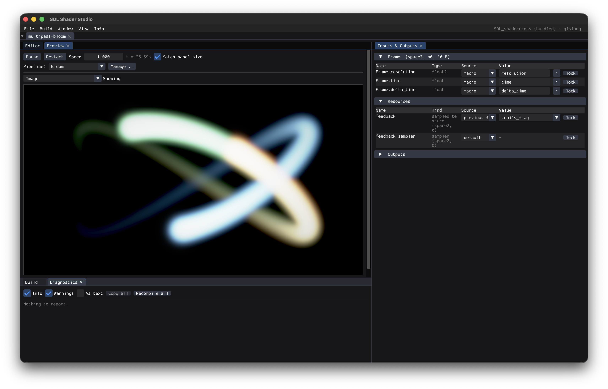
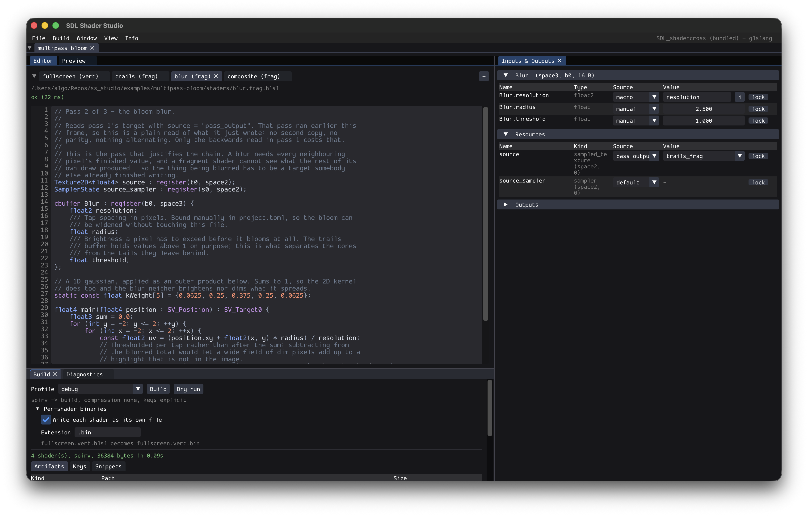
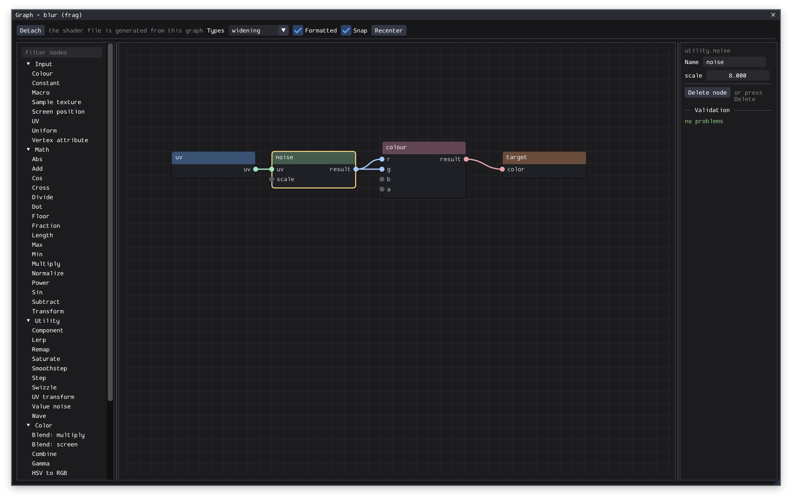
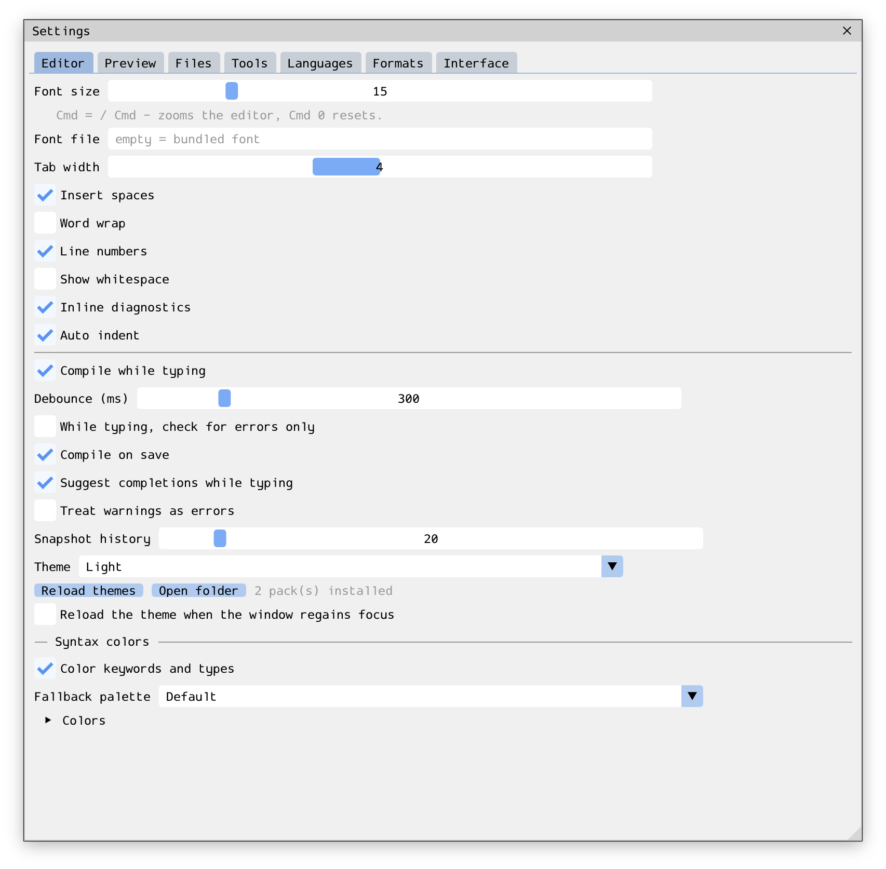

# SDL Shader Studio

A cross-platform desktop tool for writing, testing and packing shaders for the
SDL 3.4 GPU API. Write HLSL, see it live, and get a pack plus a single-header
loader you can drop into an SDL project.

<table>
  <tr>
    <td width="50%" align="center" valign="top">
      
      <br><sub><b>Live preview</b> - a multipass bloom pipeline, with its reflected inputs</sub>
    </td>
    <td width="50%" align="center" valign="top">
      
      <br><sub><b>Editor</b> - an HLSL blur pass, its bindings, and the Build panel</sub>
    </td>
  </tr>
  <tr>
    <td width="50%" align="center" valign="top">
      
      <br><sub><b>Node graph</b> - a fragment shader authored as a graph</sub>
    </td>
    <td width="50%" align="center" valign="top">
      
      <br><sub><b>Settings</b> - editor options in the light theme</sub>
    </td>
  </tr>
</table>

---

## Contents

- [About the app](#about-the-app)
  - [What it does](#what-it-does)
- [Running the app](#running-the-app)
  - [Quick start](#quick-start)
  - [Prerequisites](#prerequisites)
  - [macOS](#macos)
  - [Linux](#linux)
  - [Windows](#windows)
  - [Useful configure options](#useful-configure-options)
  - [How SDL_shadercross is reached](#how-sdl_shadercross-is-reached)
  - [The command line tool](#the-command-line-tool)
  - [Using it](#using-it)
- [The pack format is yours](#the-pack-format-is-yours)
- [Theming](#theming)
- [Things worth knowing](#things-worth-knowing)
- [Tips and tricks](#tips-and-tricks)
- [HLSL and GLSL references](#hlsl-and-glsl-references)

## About the app

SDL Shader Studio sits between your text editor and your game. It compiles what
you type, shows you the result immediately, and produces a runtime artifact your
engine loads with a few lines of C or C++. The core is deliberately narrow: it
does not want to be your engine, your asset pipeline, or your IDE.

### What it does

**Authoring.** A tabbed editor with line numbers, inline diagnostics, and
autocomplete driven by your own shader rather than by a word list. Everything the
file declares - locals, parameters, functions, structs, `#define`s - is offered
first, then your uniform members and texture names from the last compile, then
the language's own built-ins, because that is the order of how hard the name
would be to look up. Typing two letters opens the list; Ctrl+Space opens it
anywhere, including inside a word you have already finished. Up and Down choose,
Tab or Enter inserts, Esc dismisses.

It knows where the caret is, not just what is under it. After a `.` you get that
value's members and nothing else: the components of a vector, sized to the vector
(`myVec.` on a `float2` offers `x` and `y` and stops there, and tells you that
`.xy` is a `float2` while `.x` is a `float`), or the fields of a struct, followed
through as far as you care to go - `input.uv.` knows it is down to two
components. A name it never saw declared offers nothing rather than guessing.

After a `:` you get HLSL semantics and nothing else, ranked by the stage this
shader actually is - `SV_Target` in a fragment shader, `SV_DispatchThreadID` in a
compute one - and `TEXCOORD0` and `NORMAL` are offered there even though the
highlighter will not color them, because after a colon they cannot be anything
but a semantic. In a GLSL file there are no semantics and the list never claims
otherwise.

The stage filters the built-ins too: no `ddx` or `fwidth` or `discard` in a
vertex shader, no `barrier()` outside a compute one. Those are compile errors,
and offering one is only a faster way to reach it. So is offering a local from a
function you are not in, or a helper you have not written yet - the list is
scoped, both ends.

Control flow arrives as a whole statement: `for` writes the loop, indented the
way you have the editor set, with the caret left inside the condition.
`Texture2D` and `cbuffer` write themselves into the register space SDL expects.

Indentation follows the code. Enter carries the current line's indentation down
and adds a level when the line opens a scope; typing `{` then Enter puts the
closing brace on its own line with the caret between the two. Tab goes to the
next stop and Shift+Tab comes back out, both across a whole selection when there
is one, and backspace in a line's leading spaces removes a level rather than one
space. What a level is - how many columns, spaces or tabs - is the "tab width"
and "insert spaces" settings, and "auto indent" turns the Enter behaviour off
without taking Tab with it.

Both HLSL and GLSL are first-class, and a single project can mix them: a vertex
shader in HLSL feeding a fragment shader in GLSL is validated for you, matched by
location rather than by name.

**Adding and managing shaders.** The `+` beside the tab row opens a short menu:
create a shader, or open one you had closed. Creating - also File > New shader,
also Ctrl+Shift+N - is a short form of name, stage, language and file, and writes
the chosen template out, so the new shader compiles and previews the moment it
appears rather than starting as an empty buffer. Every stage starts from its own
template or from an empty file; a vertex shader can also start from the
screen-covering triangle.

**A shader has a name and an id, and they are not the same string.** The name is
what you type and what the editor calls it: `test`, in `test.frag.hlsl`. The id
adds the stage and the language, joined by underscores, exactly as the extension
does - `test_frag_hlsl`. That is what keeps one name usable everywhere, so
`test.vert.hlsl`, `test.frag.hlsl` and `test.frag.glsl` can sit side by side in a
project while the generated header still enumerates three distinct shaders. The
id belongs to the manifest and the header rather than to you: the New shader and
Rename forms show it before you commit, and nothing else in the editor does.
Right-click any shader tab to
save, rename, duplicate, copy its path, point the preview at it, or delete it.

**Tabs close without closing anything.** A shader you are not working on right
now can be closed with the cross on its tab, or in bulk from the context menu -
close others, close to the left, close to the right, close all. None of it
touches the project: the buffer stays put with its unsaved edits, its
diagnostics and its compiled blob, so the preview keeps drawing that shader, a
build still includes it, Save all still saves it, and reopening costs nothing.
That is why none of them stops to ask. Reopen from the same context menu, from the `+`
menu, or from File > Open shader, all of which list only what is closed. Closing a tab is
never removing a shader - that is Delete, at the bottom of the menu, behind a
confirmation.

How you left the tabs is remembered per project - both which were closed and
what order you dragged them into - so a project you keep tidy opens tidy next
time. It is kept with the application settings, beside the docking layout, and
never in `project.toml`: it is your view of the project rather than part of it,
and arranging your own tabs has no business showing up as a change on somebody
else's checkout. Both rules are written so that a project which changed between
sessions still behaves: what is stored is which tabs are *closed*, so a shader
added since - by a colleague, or by `ssstudio import` - arrives with a tab rather
than silently hidden, and it takes its place after the remembered ones rather
than nowhere.
Renaming carries the id everywhere it is used - bindings, provenance, the graph
and its file, scene materials, the preview selection - and leaves the shader's
pinned key alone, so a pack you have already shipped keeps loading. Deleting asks
first, and only erases the file from disk if you tick the box.

**Live preview.** Your shader renders into an offscreen target as you type,
debounced so a keystroke does not stall the UI. Hover to inspect a pixel, pause
and scrub time, or pin a version (F8) and compare it against your current edit.

**Reflection-driven I/O.** Every uniform member, texture and buffer your shader
declares appears in the Inputs & Outputs panel automatically. Bind a value by
hand, to a macro like `time` or `resolution`, or to an expression. Members named
`time` or `resolution` map themselves. Nothing is hardcoded per shader, so the
panel is never out of date with your code.

**Import a fullscreen shader.** File > Import takes a fragment shader written
against the common web convention - one `mainImage` entry point and the
`i`-prefixed uniforms - and lands it in the project as an ordinary GLSL shader.
The body is kept byte for byte; a generated prelude declares what it expects and
a generated epilogue calls it, so diagnostics still point at code you recognise.
Time, resolution, frame and mouse are already bound, so an imported shader
animates without a single binding being configured. Where the shader came from,
who wrote it and the terms it carries are recorded in the manifest and reach the
generated `SHADERS.md` - a pack you ship keeps its attributions.

**Textures, from a file or an address.** A texture binding can name an image on
disk or an `https://` address; PNG, JPEG, WebP, BMP, GIF, TGA, QOI and SVG all
load. Per-binding filter, wrap, vertical flip and sRGB are remembered in the
manifest. A downloaded image is fetched once and kept on disk, and nothing is
ever fetched on its own - opening a project someone sent you cannot make your
machine talk to an address they chose. When you are ready to share the project,
Localise copies a downloaded image into it so it stops depending on your cache.
Editing an image in another program updates the preview without a reload, and a
file caught half-written keeps showing the previous version rather than flashing
white.

**Multipass pipelines.** A pipeline can run a chain of passes before the one that
draws what you see, each rendering into a target the later ones sample - and a
buffer may sample itself a frame late, which is how anything that accumulates
over time works. Buffers default to a floating-point target, because they
routinely hold positions, counters and accumulators rather than colour. Any
target can be put on screen to see what an intermediate pass is actually
producing. A pipeline with no passes behaves exactly as it did before there were
any: one shader, straight to the screen.

**Node graph editor.** Any shader can be authored as a graph instead of text:
around 45 nodes across inputs, math, utility, colour, control flow and custom
code, generating readable HLSL or GLSL with your node names left in as comments.
Component takes a single channel out of a vector - feed it a `float2` and pick
`x` or `y` - and the picker only offers the components the thing feeding it
actually has, so a `z` off a `float2` is refused in the graph rather than in the
compiler's message about a line you did not write. Swizzle is the same idea with
more than one component: type `xy`, `bgr`, `xxxx`, and the output is as wide as
what you typed. Colour is an input node with a picker on it, producing one
`float4` rather than four channels to wire up, and Constant is the same for the
values that are not colours - pick a width, type the numbers.

The canvas pans, its two side panes drag to whatever width you want them, and a
selected node goes away with Delete. Detach at any time and the
generated source becomes yours to edit by hand - the graph is kept as a
snapshot, so the decision is reversible.

**Scene harness.** Six built-in scenarios (sprite sheet, tilemap, parallax
layers, lit 2D, post stack, spinning mesh) let you try a shader in a realistic
2D setup: hierarchical transforms, a sprite batcher, render layers and an ordered
post-processing stack. This is a test harness, not a runtime. Scenes are never
packed, never exported and never referenced by generated code; your build
produces identical output whether or not a project contains scenes.

**Build and pack.** Profiles describe what to emit: the pack, an id header, the
loader, documentation, an embed header, reflection JSON, metadata. Builds compile
in parallel, share a compile cache across projects so a shader you have already
built anywhere on your machine does not compile again, and skip rewriting
artifacts whose bytes are unchanged.

**Or one file per shader.** Add `"shaders"` to a profile's `emit` list - or tick
it under the Build panel's profile - and every shader is also written out on its
own: `test.frag.hlsl` becomes `test.frag.bin`, next to the pack. The extension is
`shader_extension` in the profile, with or without its leading dot, and empty
gives you a bare `test.frag`. When a profile builds more than one format the
format goes into the name (`test.frag.spirv.bin`, `test.frag.dxil.bin`), because
at that point one file per shader has stopped being possible. Two shaders of the
same name in different languages are written under their ids instead, and the
build says so.

**Preview pipelines.** The preview draws a named pipeline - one vertex and one
fragment shader - and a project keeps as many as you like, in its manifest, so a
combination worth coming back to is one pick from a dropdown rather than two.
A project with exactly one shader of each stage has its first pipeline made for
it, called "Default"; that happens once, so the pipeline it makes can be renamed
or deleted like any other. The last one stays, because a preview with no
pipeline has nothing to draw. The dropdown only appears when there is more than
one to choose from.

**The container format is yours.** Magic, extension, header layout, entry
ordering, key width, alignment and optional sections are all configurable. The
choice is recorded in the pack header and baked into the generated loader as a
signature, so a loader built for one layout *refuses* a pack built with another
rather than misreading it.

---

## Running the app

### Quick start

`scripts/` has one script per platform that checks your environment, builds only
when something has changed, and launches the app:

```sh
./scripts/run-macos.sh                  # macOS
./scripts/run-linux.sh                  # Linux
.\scripts\run-windows.ps1               # Windows (PowerShell)
```

Anything you pass is handed to the app, so `./scripts/run-macos.sh examples/hello`
starts with that project open. `--force` builds even when nothing changed,
`--clean` configures from scratch, `--debug` builds Debug (`-Force`, `-Clean`,
`-DebugBuild` on Windows). A missing tool is reported by name with the command
that installs it, rather than surfacing later as a CMake failure.

The rest of this section is the same thing done by hand.

### Prerequisites

| | Requirement |
|---|---|
| Compiler | C++20: GCC 12+, Clang 15+, MSVC 19.36+ (VS 2022 17.6) |
| Build system | CMake 3.21 or newer |
| Git | Needed for dependency fetching |
| Graphics | Any SDL GPU backend: Vulkan, Metal or D3D12 |

Dependencies (SDL3, SDL_shadercross, Dear ImGui, toml++, and optionally glslang,
LZ4 and zstd) are used from your system if installed and fetched automatically
otherwise. The first configure therefore takes a few minutes; later ones are fast.

The commands below use CMake's default generator, which needs nothing beyond a
compiler and CMake. If you have [Ninja](https://ninja-build.org) installed
(`brew install ninja`, `apt install ninja-build`, `winget install Ninja-build.Ninja`),
adding `-G Ninja` to the configure step gives noticeably faster incremental
builds - but it is genuinely optional and nothing else in the project depends on
it.

One trap worth knowing: the generator is baked into `build/CMakeCache.txt` on the
first configure. If you configure with one generator and then re-run with
another, CMake refuses rather than switching. Delete the directory
(`rm -rf build`) and configure again.

### macOS

```sh
xcode-select --install                 # command line tools, if you have not already
brew install cmake

# Clone or download the project first, then run the commands below from
# its root folder (the one containing CMakeLists.txt).
cmake -B build -DCMAKE_BUILD_TYPE=Release
cmake --build build -j
ctest --test-dir build --output-on-failure

"./build/bin/SS Studio.app/Contents/MacOS/SS Studio"                # start the app
"./build/bin/SS Studio.app/Contents/MacOS/SS Studio" examples/hello # with a project
```

Metal is selected automatically. Producing `.metallib` artifacts needs full Xcode
rather than only the command line tools, because `xcrun metal` comes from it.

If CMake reports `CMAKE_CXX_COMPILER not set, after EnableLanguage`, it could not
find a compiler at all: run `xcode-select --install`, and if Xcode is installed
but not selected, `sudo xcode-select --switch /Applications/Xcode.app`. Verify
with `clang --version` before configuring again.

### Linux

```sh
# Debian / Ubuntu
sudo apt install build-essential cmake git \
     libx11-dev libxext-dev libwayland-dev libxkbcommon-dev libegl1-mesa-dev \
     vulkan-tools libvulkan-dev

# Fedora
sudo dnf install gcc-c++ cmake git \
     libX11-devel wayland-devel libxkbcommon-devel mesa-libEGL-devel vulkan-devel

# Clone or download the project first, then run the commands below from
# its root folder (the one containing CMakeLists.txt).
cmake -B build -DCMAKE_BUILD_TYPE=Release
cmake --build build -j
ctest --test-dir build --output-on-failure

"./build/bin/SS Studio"
```

If `vulkaninfo` fails, install your vendor's Vulkan driver. The app still starts
and compiles shaders without one; the preview reports that no device is available
rather than crashing.

### Windows

From a **Developer PowerShell for VS 2022**:

```powershell
# Clone or download the project first, then run the commands below from
# its root folder (the one containing CMakeLists.txt).
cmake -B build -DCMAKE_BUILD_TYPE=Release
cmake --build build --config Release
ctest --test-dir build -C Release --output-on-failure

& ".\build\bin\Release\SDL Shader Studio.exe"
```

With MSYS2 or MinGW instead:

```sh
cmake -B build -DCMAKE_BUILD_TYPE=Release
cmake --build build -j
"./build/bin/SS Studio.exe"
```

DXIL output needs `dxcompiler.dll` and `dxil.dll`. SDL_shadercross ships them, and
where they have to be depends on how it is reached (see below). A release download
is run as a tool, and they are already beside that `shadercross.exe`. A build that
links SDL_shadercross loads them into this process instead, so they have to sit
next to `SDL Shader Studio.exe` - the build does not copy them there for you.

### Useful configure options

| Option | Default | Effect |
|---|---|---|
| `-DSSSTUDIO_BUILD_GUI=OFF` | ON | CLI and tests only; no SDL or ImGui needed |
| `-DSSSTUDIO_WITH_GLSLANG=OFF` | ON | Drop the GLSL front end |
| `-DSSSTUDIO_WITH_SHADERCROSS=OFF` | ON | Drop HLSL compilation and translation |
| `-DSSSTUDIO_SHADERCROSS_MODE=library\|cli` | auto | Link SDL_shadercross, or run its command line tool (see below) |
| `-DSSSTUDIO_WITH_LZ4=OFF` | ON | Drop LZ4 pack compression |
| `-DSSSTUDIO_WITH_ZSTD=ON` | OFF | Add zstd pack compression |
| `-DSSSTUDIO_BUILD_TESTS=OFF` | ON | Skip the test target |

If a build misbehaves, start with `cmake -B build -DSSSTUDIO_BUILD_GUI=OFF`: it has
no windowing dependencies at all, which isolates whether the problem is the
pipeline or the GUI stack.

### How SDL_shadercross is reached

There are two ways to use SDL_shadercross, and picking the wrong one fails in a
way that is hard to read, so the build picks for you.

A **release download** of SDL_shadercross ships the SDL3 it was built against and
loads it through its own rpath. Linking that copy puts two SDL3s in one process.
They do not share the error buffer the shader compiler reports through, so a
failed HLSL compile arrives with no message, no file and no line - it just says
the shader is wrong and stops. When the build sees an SDL3 sitting beside the
SDL_shadercross it found, it stops linking it and drives the `shadercross`
command line tool instead: a process per compile, one SDL3 in the app, and DXC's
real output with the position intact.

A SDL_shadercross **built as part of this project** shares this project's SDL3 and
has no such problem, so it is linked directly.

`-DSSSTUDIO_SHADERCROSS_MODE=library` or `=cli` overrides the choice.

**The build ships the toolchain with the application.** In `cli` mode the
`shadercross` tool and the libraries it loads are copied in beside what was
built - `Contents/Resources/tools/shadercross` inside the macOS bundle, a
`tools/shadercross` directory next to the executable everywhere else - so a copy
handed to someone else compiles HLSL without them installing anything. The
`bin/` and `lib/` layout is mirrored rather than flattened, because the tool
finds its libraries through an rpath of `@executable_path/../lib`; keeping them
one directory over is also what stops the SDL3 the toolchain ships from landing
beside the application's own, which is the problem the separate process exists
to avoid in the first place.

At runtime the tool is looked for under **Settings > Tools > shadercross dir**
first, then the bundled copy, then where the build found the package, then on
`PATH`. The override comes first so a newer toolchain, or one built for a
different target, can be swapped in from the app without reconfiguring; the
bundled copy comes before the build's own path because that path is absolute and
means nothing on a machine other than the one that did the building.

### The command line tool

The same build produces `ssstudio`, which does everything except preview:

```sh
./build/bin/ssstudio new MyShaders
./build/bin/ssstudio check MyShaders
./build/bin/ssstudio build MyShaders --profile release
./build/bin/ssstudio inspect MyShaders/build/release/shaders.s3pack
```

### Using it

```sh
ssstudio new MyShaders                # scaffold a project
ssstudio import MyShaders toy.glsl    # wrap and add a fullscreen fragment shader
ssstudio import MyShaders chain.json  # import a whole multipass chain
ssstudio check MyShaders              # front-end pass, diagnostics only
ssstudio build MyShaders --profile release
ssstudio inspect MyShaders/build/release/shaders.s3pack
ssstudio keys MyShaders               # what key each shader will get
```

A build emits the pack plus whatever the profile asks for: `shaders.h` (the id
enum and resource counts), `s3pack.h` (the loader), `SHADERS.md` (tables and
copy-pasteable snippets), and optionally an embed header, reflection JSON,
metadata TOML and a CMake snippet.

Consuming the result:

```c
#define S3PACK_IMPLEMENTATION
#include "s3pack.h"
#include "shaders.h"

S3PACK_Pack pack;
S3PACK_OpenFile(&pack, "shaders.s3pack");
SDL_GPUShader *vs = S3PACK_CreateShader(device, &pack, SHADER_SPRITE_VERT);
```

```cpp
auto pack = s3pack::Pack::open_file("shaders.s3pack");
s3pack::Shader vs = pack->shader(device, SHADER_SPRITE_VERT);   // releases itself
s3pack::ComputePipeline blur = pack->compute(device, SHADER_BLUR_COMP);
SDL_DispatchGPUCompute(pass, blur.groups_for(w, 0), blur.groups_for(h, 1), 1);
```

Shader keys are numeric and stable: the first build derives one from the shader
id and pins it in `project.toml`, so shipping a new pack to an older binary keeps
working. Strings never appear on the runtime path.

## The pack format is yours

Magic, file extension, header preset, entry ordering, blob/table order, key
width, alignment and the optional name/reflection/user sections are all
configurable in Settings → Formats or per build profile (see
`examples/hello/project.toml`). Whatever you choose is recorded in the header and
baked into the generated loader as a signature, so a loader built for one layout
refuses a pack built with another instead of misreading it.

See `docs/PACK_FORMAT.md` for the byte-level specification.

## Theming

Today: three built-in interface themes (dark, light, classic), three syntax
palettes, and per-token colours you can edit in Settings or by hand in the
`[editor.syntax]` block of the settings file. That is the whole surface - the
rest of the interface's colours are compiled in.

Beyond that, the interface is themeable by **theme packs**: a TOML file under
`themes/`, beside the settings file or shipped with the application. A pack
layers a named palette, twenty semantic roles, and per-widget overrides, so a
theme that sets twenty colours gets a coherent interface rather than needing all
sixty-three - every widget colour, the editor's syntax and diagnostic ink, the
node graph and the preview's chrome derive from those roles unless the pack says
otherwise. Colours you have edited yourself stay edited, one kind at a time, and
Settings marks which those are.

`ssstudio theme <pack> --resolve --lint` says what a pack resolved to, which
layer each value came from, and what is unreadable in it.
`themes/midnight.s3theme` is a worked example.

See `docs/THEME_PACK_FORMAT.md` for the full specification.

## Things worth knowing

**Register spaces are the thing everyone gets wrong.** SDL GPU expects resources
and uniforms in specific spaces per stage, and the driver's error when you get it
wrong is not friendly. The rules:

| Stage | Sampled / read-only | Read-write | Uniform buffers |
|---|---|---|---|
| Vertex | `space0` / `set = 0` | - | `space1` / `set = 1` |
| Fragment | `space2` / `set = 2` | - | `space3` / `set = 3` |
| Compute | `space0` / `set = 0` | `space1` / `set = 1` | `space2` / `set = 2` |

Every starter template gets this right, the validator flags mistakes, and the
autocomplete snippets insert the correct space for the stage you are in.

**Shader keys are numeric and pinned.** The first build derives a key from the
shader id and writes it into `project.toml`. It never changes after that, so a
new pack shipped to an older binary keeps working. Renaming a shader changes its
id, not its key.

**The core links no SDL.** Compilation, reflection, packing and code generation
run with no GPU, no display and no SDL install - which is why the pipeline is
testable in CI, and why a preview bug cannot affect what gets packed.

**Uniform padding will bite you.** HLSL packs constant buffers in 16-byte rows,
and a `float3` followed by a `float` is not the same as a `float4`. The generated
`shaders.h` includes a matching C struct with a `sizeof` assertion, so a mismatch
is a compile error in your engine rather than garbage on screen.

**Preview is not shipping.** Anything the preview or a scene provides - macros,
scene state, built-in meshes - exists to answer "does this look right". Your game
supplies those values itself at runtime.

## Tips and tricks

- **Between languages, the traps are naming, not semantics.** `lerp`/`mix`,
  `frac`/`fract`, `saturate`/`clamp(x, 0, 1)`, `rsqrt`/`inversesqrt`,
  `ddx`/`dFdx`, and `mul(m, v)` versus `m * v`. Autocomplete names the other
  spelling in the tooltip.
- **HLSL multiplies as `mul(matrix, vector)`; GLSL as `matrix * vector`.**
  Getting this backwards produces a plausible-looking but wrong transform, which
  is worse than a crash. The graph's Transform node emits the right form per
  language.
- **Prefer `saturate`/`clamp` over `if`.** Branch divergence usually costs more
  than the arithmetic you avoided, and both compile to a single instruction on
  most hardware.
- **Use `smoothstep` for edges, not `step`.** Hard steps alias badly at any
  resolution you did not test at.
- **Scale by resolution, not by pixels.** Multiply by `resolution.x /
  resolution.y` to correct aspect rather than assuming a size; the preview lets
  you set an exact target size so you can check.
- **`sin(time)` everywhere makes everything pulse together.** Vary the frequency
  per element, or drive movement from a hash of position.
- **Watch precision on mobile.** `float` in a GLSL fragment shader can be
  `mediump` on some targets, and large coordinate values lose precision fast.
  Keep UV maths near the origin.
- **Read the generated `SHADERS.md` after your first build.** It lists every
  binding, the create-info counts, and copy-pasteable snippets - generated from
  reflection, so it cannot drift from your shader.
- **Pin a version before a big edit** (F8). It costs nothing, and makes "what did
  I just break" a two-second answer instead of a rebuild.

## HLSL and GLSL references

Reference material, roughly in the order it becomes useful:

- **SDL GPU documentation** - <https://wiki.libsdl.org/SDL3/CategoryGPU>. Start
  with `SDL_CreateGPUShader` and `SDL_CreateGPUComputePipeline`; the binding
  model notes there are the authority for the table above.
- **SDL_shadercross** - <https://github.com/libsdl-org/SDL_shadercross>. The
  translation layer this tool uses for HLSL to SPIR-V/DXIL/DXBC/MSL.
- **HLSL reference (Microsoft)** -
  <https://learn.microsoft.com/en-us/windows/win32/direct3dhlsl/dx-graphics-hlsl-reference>.
  The intrinsic list and the packing rules for constant buffers.
- **Khronos GLSL wiki and specification** -
  <https://www.khronos.org/opengl/wiki/OpenGL_Shading_Language>. For
  Vulkan-dialect GLSL, the `layout(set=, binding=)` syntax matters most here.
- **The Book of Shaders** - <https://thebookofshaders.com/>. The best gentle
  introduction to fragment shader thinking; GLSL, but the ideas port directly.
- **Inigo Quilez's articles** - <https://iquilezles.org/articles/>. Distance
  fields, noise, smooth minimum, colour palettes. Dense and worth the time.
